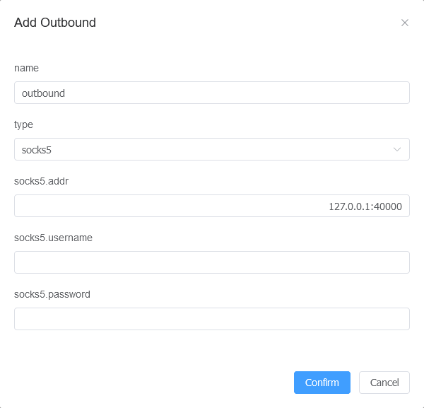

<div align="center">

<a href="https://github.com//apapar/h-ui-warp"></a>

<h1 align="center">H UI</h1>

[English](README_EN.md) / [简体中文](README_ZH.md) / فارسی

Just the panel for Hysteria2

پنل Hysteria2

<p>
<a href="https://www.gnu.org/licenses/gpl-3.0.html"></a>
<a href="https://github.com/jonssonyan/h-ui/stargazers"></a>
<a href="https://github.com/jonssonyan/h-ui/forks"></a>
<a href="https://github.com/jonssonyan/h-ui/releases"></a>
<a href="https://hub.docker.com/r/jonssonyan/h-ui"></a>
</p>


</div>

## امکانات 


- سبک وزن، استفاده کم از منابع، نصب آسان
- نظارت کامل بر وضعیت سیستم و Hysteria2 
- اعمال محدودیت حجمی ، تاریخ و تعداد دستگاه برای کاربران
- بازنشانی حجم مصرفی کاربران
- تهیه پشتیبان از کاربران
- مدیریت تنظیمات Hysteria2 و نسخه های Hysteria2
- تغییر آسان پورت اتصال و ضریب مصرفی ترافیک
- صفحه نمایش گزارش های سیستم و گزارش‌های Hysteria2
- پشتیبانی از زبان  English & 简体中文
- طراحی واکنشگرا، پشتیبانی از حالت شب، تم های صفحه سفارشی
- ویژگی های بیشتر در انتظار شما برای کشف

## سیستم عامل مورد نیاز
<p align="left">
CentOS 8+/Ubuntu 20+/Debian 11+<br>
CPU: x86_64/amd64 arm64/aarch64<br>
RAM: ≥ 256MB
</p>

### نصب

**بروزرسانی سیستم**
```bash
apt update
```

**دریافت سریع گواهی ssl (اختیاری)**
```bash
bash <(curl -Ls https://raw.githubusercontent.com/apapar/h-ui-warp/main/ssl.sh --ipv4)
```
مسیر پیشفرض گواهی ها : <br>
```bash
/root/cert.crt
```
```bash
/root/private.key
```


**نصب پنل هیستریا2**
```bash
bash <(curl -fsSL https://raw.githubusercontent.com/apapar/h-ui-warp/main/install.sh)
```
پیشنهاد ما در زمان نصب انتخاب گزینه  4. Install H UI (systemd) می باشد<br>
توجه نمایید برای راه اندازی هسته هیستریا2 باید از داخل پنل، قسمت مدیریت هیستریا<br>
گزینه های Obfuscation و TLS را تکمیل نمایید

**نصب وارپ بصورت پروکسی (پیشنهادی)**
```bash
wget -N https://gitlab.com/fscarmen/warp/-/raw/main/menu.sh && bash menu.sh w
```
راهنمای نصب وارپ : <br>
در مرحله انتخاب پورت پیشنهاد میشود  اینتر برنید و از پورت پیش فرض استفاده کنید<br>
در مراحل بعد گزینه warp+ را انتخاب کنید<br>
از ربات تلگرامی @generatewarpplusbot یک کلید دریافت و در این قسمت جایگذاری کنید<br>
اگر مراحل درست طی شود با این پیام مواجه می شوید<br>
 Local Socks5: 127.0.0.1:40000(پورت ممکن است متفاوت باشد)<br>
حال میتوانید در پنل هیستریا یک خروجی ساکس5 بر روی این آیپی و پورت تعریف کنید



## اطلاعات پیشفرض

**پورت پیشفرض پنل : 8081**
**نام کاربری و رمز عبور پیشفرض : sysadmin**

## بروزرسانی سیستم

ابتدا یک فایل پشتیبان از کاربران تهیه کنید، سپس نسخه جدید را نصب کنید


## بهینه سازی عملکرد

- میتوانید یک کرون ری استارت تنظیم کنید

    ```bash
    0 4 * * * /sbin/reboot
    ```

- میتوانید یک شتابدهنده شبکه نصب کنید
    - [TCP Brutal](https://github.com/apernet/tcp-brutal) (توصیه شده)
    - [teddysun/across#bbrsh](https://github.com/teddysun/across#bbrsh)
    - [Chikage0o0/Linux-NetSpeed](https://github.com/ylx2016/Linux-NetSpeed)
    - [ylx2016/Linux-NetSpeed](https://github.com/ylx2016/Linux-NetSpeed)

## داکیومنت هیستریا2

https://v2.hysteria.network/docs/getting-started/3rd-party-apps/

## حذف پنل

```bash
systemctl stop h-ui
rm -rf /etc/systemd/system/h-ui.service /usr/local/h-ui/
```


## یوتوب سازنده سیستم

https://www.youtube.com/@jonssonyan


## تاریخچه ستاره

[](https://star-history.com/#jonssonyan/h-ui&Date)

## لایسنس

[GPL-3.0](LICENSE)